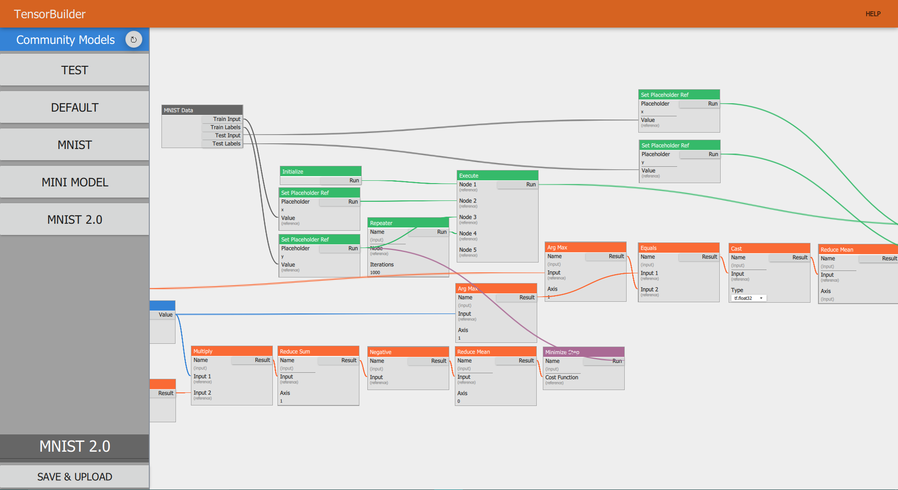
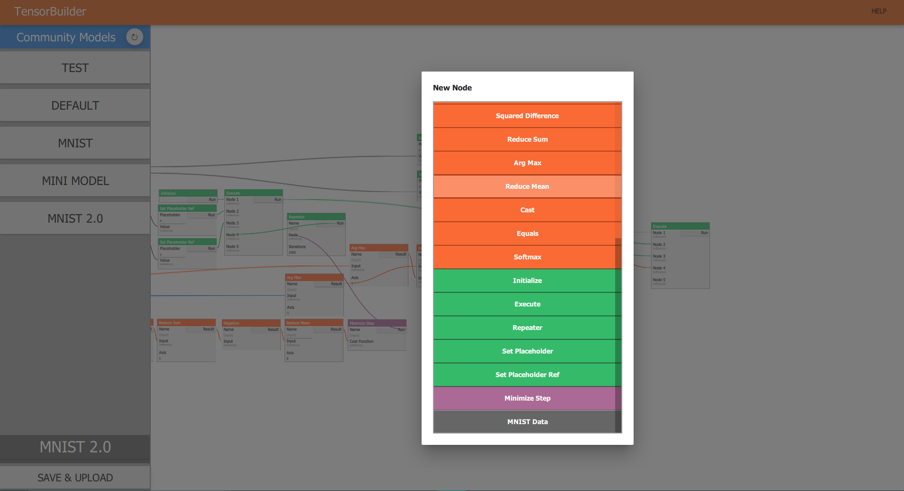
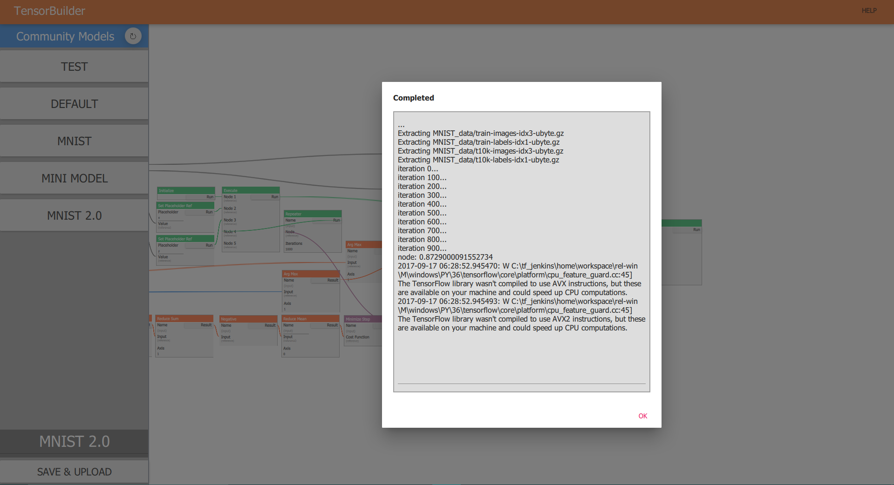
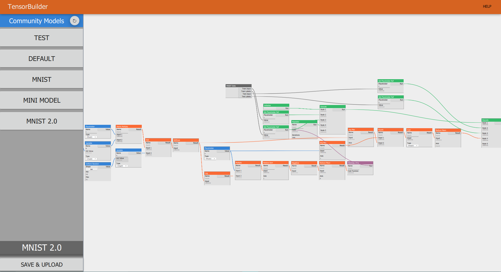

# TensorBuilder

A drag and drop GUI tool written in Qt to rapidly prototype TensorFlow computational graphs, with sharing features.

## Goals

  - To make machine learning more accessible to everyone regardless of programming backgrounds
  - To allow professionals to quickly test and experiment with different models
  - To simplify sharing and forking of experimental models for accelerated research

## Features

  - GUI flow chart for rapid prototyping of TensorFlow computational graphs
  - One-click compile and run python TensorFlow for quick feedback
  - Instant sharing to community server and browse & fork models uploaded by others

## Inspiration
Over the past few years, AI and machine learning has become one of the biggest topics around the world. With numerous open-source libraries quickly gaining popularity, it has become more and more accessible to those who are willing to learn it. However, these tools are still suited only towards those who know a decent bit of programming, and that was a big injustice in our perspective to those who want to start learning.

In order to achieve our vision, we set out to design something that would not only visualize how machine learning works, but would also provide a basic structure for building simple AIs. As such, we have developed a desktop application that allows users to create and connect nodes to form basic machines that process data. Different types of nodes are represented by different colors, as well as intuitive designs to make the learning curve smooth while offering a variety of features. The user can choose any node to run, in which the program will turn the graph into a python script built on top of Tensorflow.

However, we didn't feel that this was enough to ease someone into the field of AI. Although we had built an app that was simple to use, we still haven't found a way to teach the necessary fundamentals. It was this thought that led us to build an online community system, wherein anyone could put their own graph of nodes online for anyone else across the world to try out for themselves. Not only are we able to now provide simple graphs to showcase the basics, but people can share their own creations for others to analyze and understand as well.

## TensorBuilder
We built most of our application front end with Qt / QML, and our back end uses a combination of Firebase and AWS. The scripts outputted by the program is generated with C++ within the application itself. We support a lot of the core features from Tensorflow, allowing us to compile all of our scripts into python.

## Challenges
This whole weekend was just challenge upon challenge for us, especially since we are only a 2 man team. Some of the biggest struggles we faced included compiling from the graph to python, saving the data correctly from the client to the server, and simply coding with unfamiliar libraries and platforms. There were countless more hardships along the way, but we're both very proud of what we were able to create.

## The Future
Obviously, we wish we had more time to put in the project, but it is a hackathon after all. In this weekend, we were able to achieve a minimal prototype that aligns with our vision at the start. In the future, we want to implement more of the Tensorflow library to allow for even more creativity amongst our users, and possible an authentication system for people to save or share models that they like. In the end, we are hoping that our open-source application provides competition to proprietary software, with hopes to bring more people into the world of AI and machine learning.

